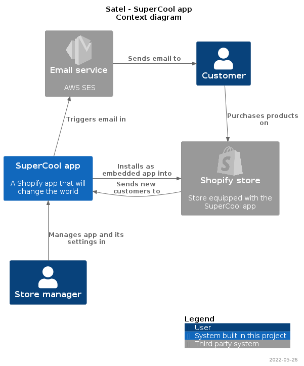

# satel-c4-plantuml

This repository provides handy templates and functions to create C4 diagrams
following a specific format:

* Rename elements in the legend, e.g.:
    * "Person" → "User"
    * "system" → "System built by Satel" for client projects
* Format the title
* Date in the footer

The examples provided in  give a guideline for file naming convention and reuse of code
between the various diagrams in order to avoid duplicating code and mismatches in naming
of diagram elements:

```bash
docs
├── context.puml     # for the context diagram
├── container.puml   # for the container diagram
├── deployment.puml  # for the deployment diagram
└── sequence_*.puml  # for each sequence diagram
```

## Diagram setup function

This library provides a function for each type of diagram that applies the standardized
format:

```plantuml
SatelContextDiagram($client, $project)
SatelContainerDiagram($client, $project)
SatelDeploymentDiagram($client, $project)
SatelSequenceDiagram($client, $project)
```

## Client versus internal diagram

The wording and formatting is slightly different if the diagrams are for a client's project
or one of Satel's internal project. The library knows that it's an internal project when
the client is set to `Satel`:

* Client project context diagram
```plantuml
@startuml
!include https://raw.githubusercontent.com/SatelCreative/satel-c4-plantuml/main/C4Satel.puml

SatelContextDiagram("ACME corporation", "Ecommerce store")
```
* Satel internal project context diagram
```plantuml
@startuml
!include https://raw.githubusercontent.com/SatelCreative/satel-c4-plantuml/main/C4Satel.puml

SatelContextDiagram("Satel", "SuperCool app")
```

## Examples

### Client project

```plantuml
' context.puml
@startuml
!include https://raw.githubusercontent.com/SatelCreative/satel-c4-plantuml/main/C4Satel.puml
!include <logos/oracle>

SatelContextDiagram("ACME corporation", "Ecommerce store")

Person(customer, "Customer")
System_Ext(erp, "ERP", "ACME corporation's ERP", $sprite=oracle)
System(store, "Ecommerce Store", "Store where customers by things")

Rel_D(customer, store, "Purchases products on")
Rel_R(store, erp, "Reads product data from and sends orders to")

SHOW_LEGEND()

@enduml
```


### Satel internal project


```plantuml
' context.puml
@startuml
!include https://raw.githubusercontent.com/SatelCreative/satel-c4-plantuml/main/C4Satel.puml
!include <logos/shopify>
!include <logos/aws-ses>

SatelContextDiagram("Satel", "SuperCool app")

Person(customer, "Customer")
Person(manager, "Store manager")
System_Ext(shopify, "Shopify store", "Store equipped with the SuperCool app", $sprite=shopify)
System_Ext(email, "Email service", "AWS SES", $sprite=aws-ses)
System(app, "SuperCool app", "A Shopify app that will change the world")

Rel_D(customer, shopify, "Purchases products on")
Rel_R(app, shopify, "Installs as embedded app into")
Rel_L(shopify, app, "Sends new customers to")
Rel_U(app, email, "Triggers email in")
Rel_R(email, customer, "Sends email to")
Rel_U(manager, app, "Manages app and its settings in")

SHOW_LEGEND()

@enduml
```


