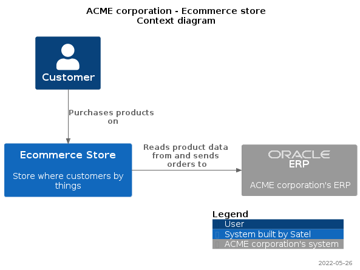

# satel-c4-plantuml

This repository provides handy templates and functions to create C4 diagrams
following a specific format:

* Rename elements in the legend, e.g.:
    * "Person" → "User"
    * "system" → "System built by Satel" for client projects
* Format the title
* Date in the footer

The examples provided in  give a guideline for file naming convention and reuse of code
between the various diagrams in order to avoid duplicating code and mismatches in naming
of diagram elements:

```bash
docs
├── context.puml     # for the context diagram
├── container.puml   # for the container diagram
├── deployment.puml  # for the deployment diagram
└── sequence_*.puml  # for each sequence diagram
```

## Example

```plantuml
' context.puml
@startuml
!include https://raw.githubusercontent.com/SatelCreative/satel-c4-plantuml/main/C4Satel.puml
!include <logos/oracle>

SatelContextDiagram("ACME corporation", "Ecommerce store")

Person(customer, "Customer")
System_Ext(erp, "ERP", "ACME corporation's ERP", $sprite=oracle)
System(store, "Ecommerce Store", "Store where customers by things")

Rel_D(customer, store, "Purchases products on")
Rel_R(store, erp, "Reads product data from and sends orders to")

SHOW_LEGEND()

@enduml
```


